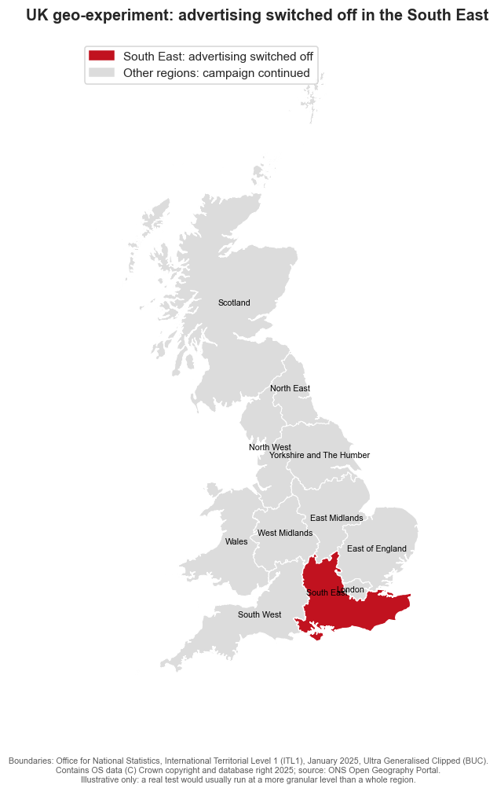
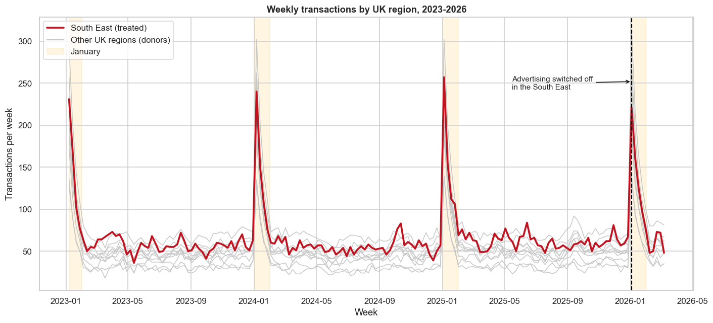
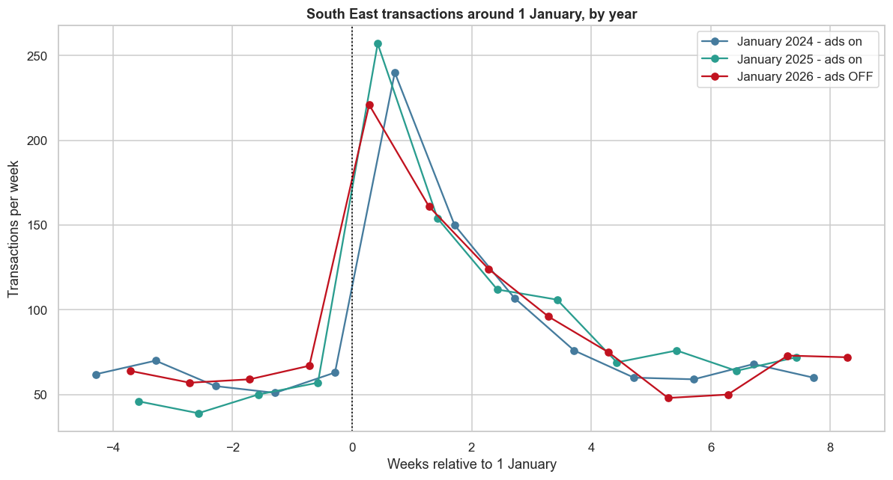
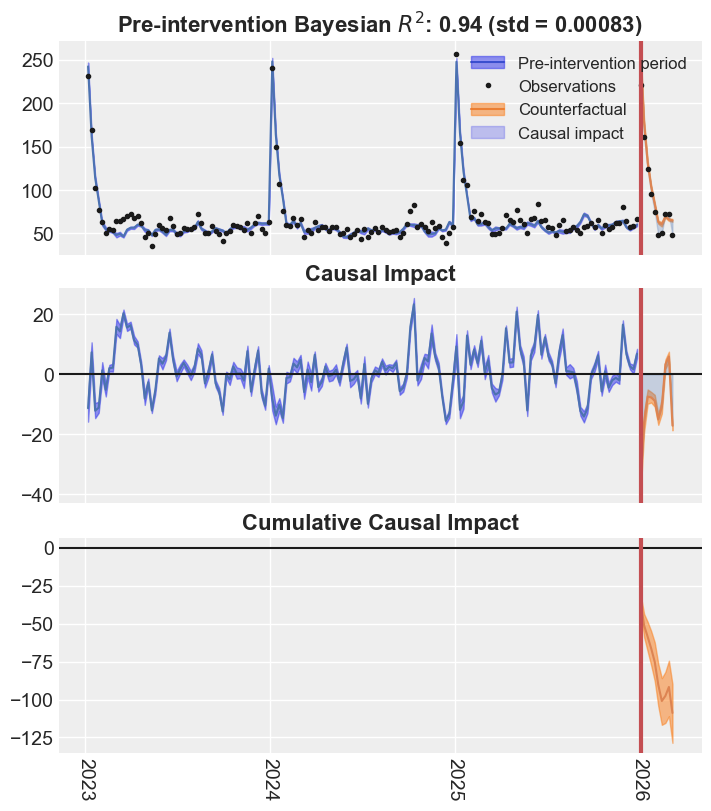
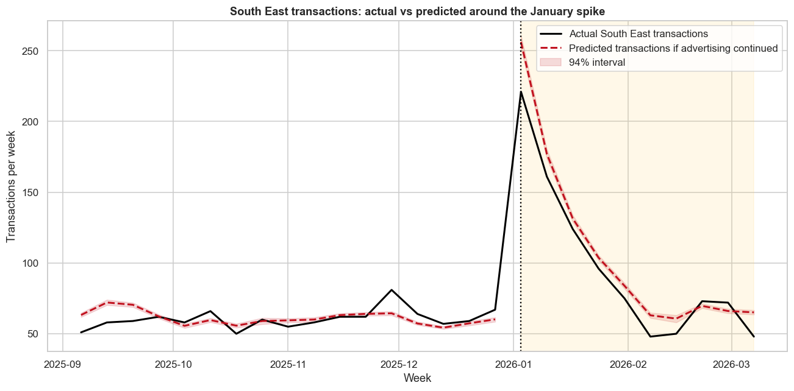

A fictional healthy meal delivery service sells meals in flexible bundles, such as three-day, five-day and seven-day plans. Customers choose the bundle that suits them rather than committing to a subscription. Every January, transactions rise sharply as customers focus on healthier eating, convenience and New Year goals.

The business normally supports that demand with a national campaign across paid search, paid social, online video and display. The platforms report a return on ad spend above 3. On the surface, the campaign looks like an obvious success.

The CMO believes the commercial context has changed. Brand awareness has grown, direct and organic demand are stronger, and the business faces less pressure from competitors than it did when the campaign strategy was established. As a result, advertising may now be capturing more demand that the brand would have won anyway.

The CMO has a harder question: **how much of the January spike would happen without advertising?**

Platform attribution can tell the business which transactions received an ad touchpoint. It cannot establish how many of those transactions were caused by the campaign. To estimate that, the business runs a geo-experiment.

## The switch-off test

The normal January campaign continues across Great Britain, except in the **South East**, where advertising is switched off for ten weeks. The South East is the treated region. The other ten regions form the donor pool used to estimate what would have happened if advertising had continued.

Switching advertising off nationally would put the entire business at risk if the campaign is more incremental than expected. A geo-test is a safer option because it limits that risk to one area while the rest of the country continues to receive advertising.

Because this is a switch-off test, a negative impact means transactions were lost when advertising was removed. The value of keeping advertising on is the same quantity with its sign reversed.

```{python}
#| echo: true
#| eval: false
#| code-fold: true
#| code-summary: "Show imports and experiment setup"
from pathlib import Path
import warnings

import arviz as az
import causalpy as cp
import geopandas as gpd
import matplotlib.pyplot as plt
import numpy as np
import pandas as pd
import seaborn as sns
from causalpy.pymc_models import WeightedSumFitter
from matplotlib.patches import Patch
from pymc_extras.prior import Prior

SEED = 42
DATA_PATH = Path("path/to/data")

REGIONS = [
    "North East", "North West", "Yorkshire and The Humber", "East Midlands",
    "West Midlands", "East of England", "London", "South East", "South West",
    "Wales", "Scotland",
]
TREATED_UNIT = "South East"
CONTROL_REGIONS = [region for region in REGIONS if region != TREATED_UNIT]
TREATMENT_DATE = pd.Timestamp("2026-01-03")
```

## Where the test ran

The map makes the design concrete. The campaign continued in every grey donor region and was withheld in the red treated region.

```{python}
#| echo: true
#| eval: false
#| code-fold: true
#| code-summary: "Show region map code"
GEO_URL = (
    "https://services1.arcgis.com/ESMARspQHYMw9BZ9/arcgis/rest/services/"
    "ITL1_JAN_2025_UK_BUC/FeatureServer/0/query"
    "?where=1%3D1&outFields=ITL125CD,ITL125NM&f=geojson"
)
gdf = gpd.read_file(GEO_URL)
gdf["region"] = (
    gdf["ITL125NM"]
    .str.replace(" (England)", "", regex=False)
    .replace({"East": "East of England"})
)
gdf = gdf[gdf["region"].isin(REGIONS)].to_crs(27700)

fig, ax = plt.subplots(figsize=(8, 10))
others = gdf[gdf["region"] != TREATED_UNIT]
treated = gdf[gdf["region"] == TREATED_UNIT]

others.plot(ax=ax, color="#dcdcdc", edgecolor="white", linewidth=0.7)
treated.plot(ax=ax, color="#c1121f", edgecolor="white", linewidth=0.9)

for _, row in gdf.iterrows():
    point = row.geometry.representative_point()
    ax.annotate(row["region"], (point.x, point.y), ha="center", va="center", fontsize=7)

ax.set_axis_off()
ax.set_title("UK geo-experiment: advertising switched off in the South East")
ax.legend(handles=[
    Patch(color="#c1121f", label="South East: advertising switched off"),
    Patch(color="#dcdcdc", label="Other regions: campaign continued"),
])
plt.show()
```

{fig-alt="Map of Great Britain with the South East highlighted in red as the treated region and the ten donor regions shown in grey." width=70% fig-align="center"}

The map uses Office for National Statistics International Territorial Level 1 boundaries. A real test would usually use more granular areas, subject to sufficient transaction volume and limited cross-border contamination.

## Load the data

The weekly regional transaction data used in this post is **synthetic**. It is designed to reflect recurring January demand, gradual growth in baseline demand as brand awareness strengthens, and a measurable advertising effect, without representing any real company or customer.

The synthetic generation code is intentionally omitted. The analysis starts from a fixed CSV so the causal workflow stays in focus.

```{python}
#| echo: true
#| eval: false
#| code-fold: true
#| code-summary: "Show data import"
transactions = pd.read_csv(
    DATA_PATH / "synthetic_weekly_transactions.csv",
    index_col="date",
    parse_dates=True,
)[REGIONS]
```

There are 166 weekly observations from January 2023 to March 2026. Of these, 156 weeks occur before the switch-off and ten occur after it.

## What the history tells us

### Three years of transactions by region

The South East is shown in red against the donor regions in grey. January periods are shaded and the 2026 switch-off date is marked.

```{python}
#| echo: true
#| eval: false
#| code-fold: true
#| code-summary: "Show regional history plotting code"
fig, ax = plt.subplots(figsize=(13, 6))
for region in CONTROL_REGIONS:
    ax.plot(transactions.index, transactions[region], color="0.78", lw=1.0)
ax.plot(transactions.index, transactions[TREATED_UNIT], color="#c1121f", lw=2.4)

for year in sorted(transactions.index.year.unique()):
    ax.axvspan(
        pd.Timestamp(year, 1, 1),
        pd.Timestamp(year, 2, 1),
        color="#ffd166",
        alpha=0.20,
    )

ax.axvline(TREATMENT_DATE, color="black", ls="--", lw=1.4)
ax.set(
    title="Weekly transactions by UK region, 2023-2026",
    xlabel="Week",
    ylabel="Transactions per week",
)
plt.show()
```

{fig-alt="Weekly transactions for eleven UK regions from 2023 to 2026, with the South East highlighted and January periods shaded."}

The regions share the same broad seasonal pattern, rising and falling at broadly similar times. That co-movement is what makes a synthetic control plausible. Essentially, the regions in grey need to explain the region in red well enough that their combined history provides a credible comparison. Similar seasonality alone is not sufficient, so the pre-treatment fit still needs to be checked.

### South East January transactions, year on year

Comparing the weeks around 1 January shows that the spike in transactions is recurring. January 2026 still rises sharply even though advertising is off. The switch-off lowers the peak, but does not remove it.

```{python}
#| echo: true
#| eval: false
#| code-fold: true
#| code-summary: "Show January comparison plotting code"
fig, ax = plt.subplots(figsize=(11, 6))
colours = {2024: "#457b9d", 2025: "#2a9d8f", 2026: "#c1121f"}

for year in [2024, 2025, 2026]:
    start = pd.Timestamp(year - 1, 12, 1)
    end = pd.Timestamp(year, 2, 28)
    segment = transactions.loc[start:end, TREATED_UNIT]
    weeks_from_january = (segment.index - pd.Timestamp(year, 1, 1)).days / 7
    status = "ads OFF" if year == 2026 else "ads on"
    ax.plot(
        weeks_from_january,
        segment,
        marker="o",
        color=colours[year],
        label=f"January {year} - {status}",
    )

ax.axvline(0, color="black", ls=":", lw=1.2)
ax.set(
    title="South East transactions around 1 January, by year",
    xlabel="Weeks relative to 1 January",
    ylabel="Transactions per week",
)
ax.legend()
plt.show()
```

{fig-alt="South East transactions around January for 2024, 2025 and 2026, showing a recurring spike that remains visible during the 2026 advertising switch-off."}

## Build the counterfactual

[CausalPy](https://causalpy.readthedocs.io/) finds a weighted combination of untreated regions that behaves like the South East before the switch-off. That synthetic South East estimates what would probably have happened had the campaign continued.

The donor weights are non-negative and sum to one, ensuring that if every donor region sees one additional transaction, so does our counterfactual. The Bayesian model also carries uncertainty from the pre-period into the post-period counterfactual.

```{python}
#| echo: true
#| eval: false
#| code-fold: true
#| code-summary: "Show synthetic control model code"
sample_kwargs = {
    "draws": 1000,
    "tune": 1500,
    "chains": 4,
    "target_accept": 0.97,
    "nuts_sampler": "numpyro",
    "random_seed": SEED,
    "progressbar": False,
}
pre_period = transactions.index < TREATMENT_DATE
sigma_scale = transactions.loc[pre_period, TREATED_UNIT].std(ddof=0)

model = WeightedSumFitter(
    sample_kwargs=sample_kwargs,
    priors={
        "y_hat": Prior(
            "Normal",
            sigma=Prior("HalfNormal", sigma=sigma_scale, dims=["treated_units"]),
            dims=["obs_ind", "treated_units"],
        )
    },
)

with warnings.catch_warnings():
    warnings.simplefilter("ignore")
    result = cp.SyntheticControl(
        data=transactions,
        treatment_time=TREATMENT_DATE,
        control_units=CONTROL_REGIONS,
        treated_units=[TREATED_UNIT],
        model=model,
    )
```

The model converged cleanly, with no divergences, a maximum R-hat of 1.003 and a minimum bulk effective sample size of 1,938. More importantly for design validity, the pre-treatment correlation between the observed and synthetic South East was **0.968**. Taken together, these diagnostics suggest that the model is statistically sound, fits the pre-treatment data well and is suitable for estimating the campaign effect.

The largest donor weights were North West at 36%, London at 22% and East of England at 10%. Together, those three regions account for 69% of the synthetic control.

```{python}
#| echo: true
#| eval: false
#| code-fold: true
#| code-summary: "Show CausalPy summary code"
result.summary(round_to=3)
```

```text
================================SyntheticControl================================
Treated unit: South East
North West                0.364, 94% HDI [0.079, 0.634]
London                    0.225, 94% HDI [0.053, 0.404]
East of England           0.103, 94% HDI [0.005, 0.292]
Pre-treatment correlation (South East): 0.9684
```

## CausalPy's view of the result

The package output shows the observed and counterfactual series, the weekly impact, and the cumulative impact. The gap opens after advertising is switched off and accumulates across the ten-week test. In practical terms, the South East records fewer transactions each week than it would likely have recorded with advertising still running. Those missed transactions add up throughout the test.

```{python}
#| echo: true
#| eval: false
#| code-fold: true
#| code-summary: "Show CausalPy result plot code"
fig, causalpy_axes = result.plot(treated_unit=TREATED_UNIT, show=False)
plt.show()
```

{fig-alt="CausalPy synthetic control output showing observed and counterfactual South East transactions, weekly impact and cumulative impact." width=70% fig-align="center"}

## A focused view of the spike

The full-history plot is useful for validation because it shows how closely the synthetic control tracks the South East before the test. A closer view makes the commercial result easier to see: actual transactions remain high, but they sit below the counterfactual during the switch-off. The red predicted line is clearly above the black actual line, suggesting that marketing had a real effect and that keeping the campaign running would have generated additional transactions.

```{python}
#| echo: true
#| eval: false
#| code-fold: true
#| code-summary: "Show focused spike plotting code"
focus_start = pd.Timestamp("2025-09-01")
pre_mu = result.pre_pred["posterior_predictive"]["mu"].sel(
    treated_units=TREATED_UNIT
)
post_mu = result.post_pred["posterior_predictive"]["mu"].sel(
    treated_units=TREATED_UNIT
)
pre_mean = pre_mu.mean(dim=["chain", "draw"]).to_numpy()
post_mean = post_mu.mean(dim=["chain", "draw"]).to_numpy()
pre_hdi = az.hdi(pre_mu, hdi_prob=0.94)["mu"]
post_hdi = az.hdi(post_mu, hdi_prob=0.94)["mu"]
pre_dates = result.datapre.index
post_dates = result.datapost.index
pre_keep = pre_dates >= focus_start

fig, ax = plt.subplots(figsize=(12, 6))
ax.plot(
    transactions.loc[focus_start:].index,
    transactions.loc[focus_start:, TREATED_UNIT],
    color="black",
    lw=2,
    label="Actual South East transactions",
)
ax.plot(pre_dates[pre_keep], pre_mean[pre_keep], "--", color="#c1121f", lw=2)
ax.plot(
    post_dates,
    post_mean,
    "--",
    color="#c1121f",
    lw=2,
    label="Predicted transactions if advertising continued",
)
ax.fill_between(
    post_dates,
    post_hdi.sel(hdi="lower"),
    post_hdi.sel(hdi="higher"),
    color="#c1121f",
    alpha=0.15,
    label="94% interval",
)
ax.axvline(TREATMENT_DATE, color="black", ls=":", lw=1.5)
ax.set(
    title="South East transactions: actual vs predicted around the January spike",
    xlabel="Week",
    ylabel="Transactions per week",
)
ax.legend()
plt.show()
```

{fig-alt="Focused comparison of actual South East transactions and the predicted counterfactual around the January 2026 advertising switch-off."}

## What the experiment found

Switching advertising off is estimated to have reduced South East transactions by **109** over ten weeks, with a 94% highest density interval of **90 to 129 transactions lost**. That is about **11 fewer transactions per week**, or **10.1% below the counterfactual**.

The South East recorded 968 transactions during the test. The model estimates that 1,077 would have occurred if advertising had continued.

This resolves the apparent contradiction:

- The campaign is working. Keeping it on would have generated about 109 additional transactions.
- Most demand was not incremental. The large January spike still appeared with no advertising.

## Platform ROAS versus incremental ROAS

Suppose the withheld South East campaign would have cost £8,500, each transaction is worth £55, and the platforms report £27,200 of attributed revenue.

The platform ROAS is 3.20. The experiment estimates only £5,987 of incremental revenue, giving an incremental ROAS of **0.70**.

| Measure | Platform attribution | Geo-experiment |
|---|---:|---:|
| Transactions credited | 495 | 109 |
| Revenue credited | £27,200 | £5,987 |
| ROAS | 3.20 | 0.70 |

The platform is answering, "Which transactions can I associate with an ad interaction?" The experiment is answering, "How many additional transactions happened because the ads remained on?" Budget decisions require the second answer.

## Assumptions that matter

A synthetic control is only credible when its design assumptions are credible:

1. **No spillovers.** The South East switch-off should not materially change exposure or behaviour in donor regions.
2. **No concurrent local shock.** Nothing else should change only in the South East at the treatment date.
3. **Stable measurement.** Transaction definitions and collection must remain consistent across time and regions.
4. **Strong pre-treatment fit.** The donor combination must reproduce the treated region before intervention.
5. **Stable relationship.** The pre-period relationship between the South East and donor regions should continue during the test.
6. **Sufficient duration.** The test must run long enough to capture delayed effects without drifting into a different demand regime.

The high pre-treatment correlation is encouraging, but it does not prove all six assumptions. Experimental design and operational checks remain as important as the model.

## Planning next January's campaign

The campaign should not be judged by a platform ROAS of 3.20. On these assumptions, an incremental ROAS below 1 means the current spend does not pay back on immediate transaction revenue.

That does not automatically mean switching the campaign off nationally. It means next January's plan should not simply roll forward the same budget. The experimental estimate gives the CMO a better starting point for deciding how much demand the campaign is likely to create, rather than how much existing demand the platforms are likely to claim.

Before the next January peak, the business should:

- set the budget against an incremental return target based on profit or contribution margin;
- reduce or reallocate the least productive spend instead of applying a national switch-off;
- reserve well-matched holdout areas and agree the test design before campaigns go live;
- test different spend levels or channels separately where scale allows;
- track direct and organic demand as brand awareness continues to grow;
- include longer-term effects such as repeat purchase and customer lifetime value in the final decision.

John Wanamaker is credited with a line that still captures the problem:

> ["Half the money I spend on advertising is wasted; the trouble is I don't know which half."](https://www.b2bmarketing.net/half-the-money-i-spend-on-advertising-is-wasted-the-trouble-is-i-dont-know-which-half/#)
>
> John Wanamaker

Geo-testing gives the CMO a practical way to reduce that uncertainty. It will not label every pound as productive or wasted, but it can estimate the incremental return and show whether the next pound of budget is likely to create enough value.

The next campaign can then serve two purposes: generating profitable demand and learning where the next pound of budget creates genuine value. The central lesson is simple: **a campaign can create real incremental sales and still be overspending**. Attribution made the January spike look like advertising success. The geo-experiment showed how much of that spike the advertising actually caused.

## Make experimentation standard practice

If you want to make experimentation a standard part of your marketing practice, or discuss whether geo-testing is feasible for your business, email me at [jakepiekarski@jtp-analytics.com](mailto:jakepiekarski@jtp-analytics.com).
