Product launches are often discussed as if adoption were a single number:
how many users we expect, how much demand exists, or how much volume a launch
will generate. But adoption is a path, not a point.

A few people adopt early. More follow once the product becomes visible. Later,
the remaining pool of potential adopters gets smaller and weekly adoption slows
down. The cumulative curve has the familiar S-shape: slow start, acceleration,
then flattening.

This post introduces a compact model for that shape, the Bass diffusion model,
and then fits it in [PyMC](https://www.pymc.io/) so uncertainty is carried
through the whole forecasting workflow.

The worked example uses synthetic weekly adoption data for products labelled
`iPhone 4` through `iPhone 17`, then builds a pre-launch forecast for a
hypothetical `iPhone 18`.

> All product labels and launch characteristics in this post are synthetic.
> They are convenient labels for a teaching example, not Apple sales figures,
> pricing data, media budgets, or launch plans.

## Why adoption curves bend

The Bass model says adoption comes from two mechanisms.

**Innovation** is adoption that happens independently of the current installed
base. People buy because of advertising, curiosity, product need, or their own
evaluation.

**Imitation** is adoption that depends on existing adopters. As more people
have the product, the product becomes more visible, credible, and easier to
copy.

The model has three parameters:

| Parameter | Meaning |
| --- | --- |
| $m$ | Total market potential, or the eventual size of the adopter pool |
| $p$ | Innovation coefficient, controlling independent early adoption |
| $q$ | Imitation coefficient, controlling adoption pressure from the installed base |

Let $F(t)$ be the fraction of the eventual market that has adopted by time
$t$, and let $f(t) = F'(t)$ be the instantaneous adoption rate as a fraction of
market potential. Bass diffusion starts from this hazard:

$$
\frac{f(t)}{1 - F(t)} = p + qF(t).
$$

Rearranging gives:

$$
f(t) = \left[p + qF(t)\right]\left[1 - F(t)\right].
$$

The first term is pressure to adopt. The second term is the remaining market.
Early on, imitation is weak because $F(t)$ is small. In the middle, imitation
accelerates adoption. Late in the launch, the remaining market shrinks and new
adoption falls.

Solving the differential equation gives the Bass cumulative adoption fraction:

$$
F(t) =
\frac{1 - e^{-(p+q)t}}
{1 + \frac{q}{p}e^{-(p+q)t}}.
$$

Multiplying by $m$ gives cumulative adoption in counts:

$$
N(t) = mF(t).
$$

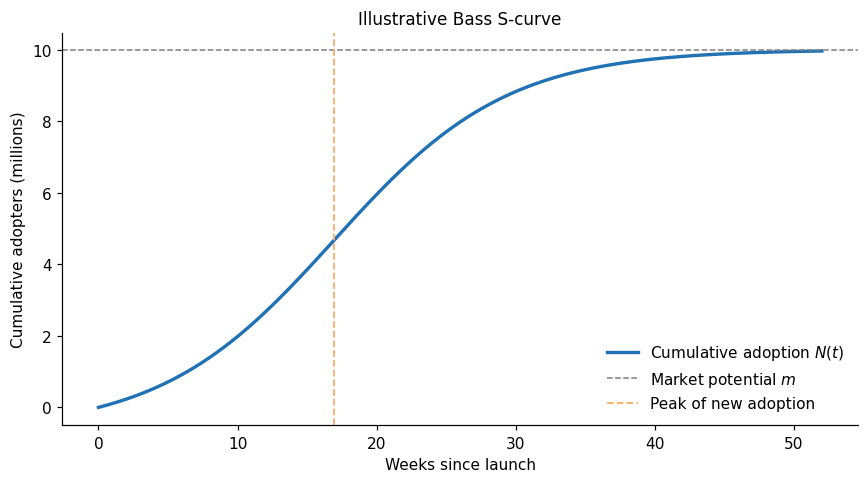{width=100%}

The example above uses $m = 10,000,000$, $p = 0.01$, and $q = 0.15$. Under
those values, the model-implied peak in new adoption occurs around week 17.
That peak is not a peak in cumulative adoption. Cumulative adoption keeps
rising; the peak is where weekly new adoption is highest.

When $q > p$, the peak time is:

$$
t_{\text{peak}} =
\frac{\log(q/p)}{p + q}.
$$

If $q \leq p$, imitation never overtakes innovation and the highest adoption
rate occurs at launch.

## Weekly data need weekly expectations

The Bass model is continuous, but the data in this example are weekly adoption
counts. That distinction matters. The expected count in a week is not the
instantaneous rate at one point in time. It is the increment of the cumulative
curve over that week:

$$
\mu_w = m\left[F(w+1) - F(w)\right].
$$

The likelihood then connects those expected weekly counts to observed weekly
adoption:

$$
Y_{i,w} \sim \operatorname{NegativeBinomial}(\mu_{i,w}, \alpha).
$$

I use a Negative Binomial rather than a Poisson because real adoption data are
usually noisier than a Poisson model allows:

$$
\operatorname{Var}(Y) = \mu + \frac{\mu^2}{\alpha}.
$$

Larger $\alpha$ means less overdispersion. As $\alpha$ grows, the likelihood
approaches a Poisson.

## The synthetic launch panel

The dataset contains 52 weeks of adoption for each of 14 product labels. Each
series is aligned by `week_since_launch`, not by calendar date.

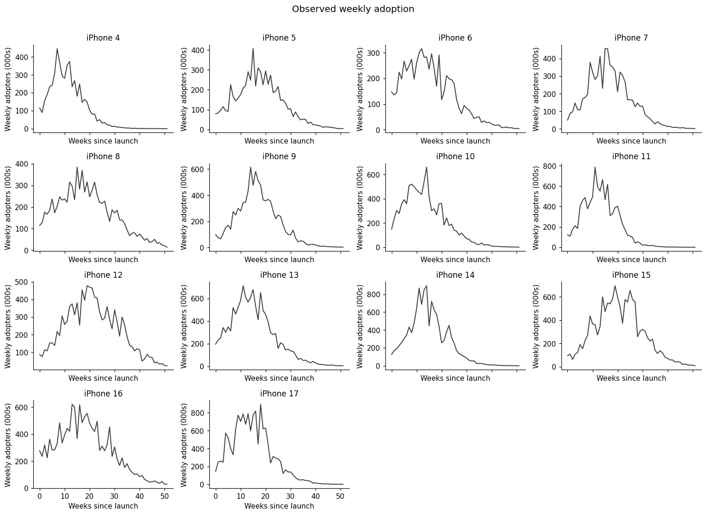{width=100%}

The weekly panels show the core object we want the model to understand: a
launch curve with a rise, a peak, and a decline. The corresponding cumulative
series show the S-curves more directly.

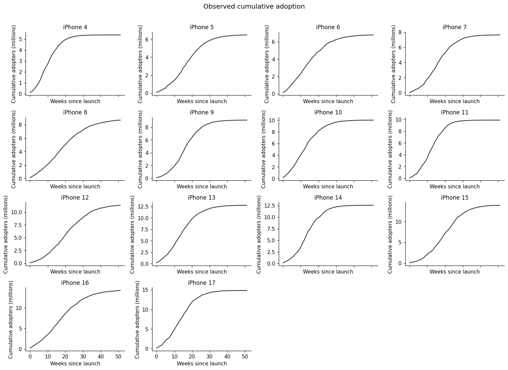{width=100%}

Some products look close to saturation by week 52. Others still have room to
grow. That matters because $m$ is an asymptote. If the observed cumulative
series has already flattened, $m$ is easier to identify. If it is still growing
quickly, many eventual market sizes may remain compatible with the first year
of data.

## Fitting Bass diffusion in PyMC

The first model is deliberately unpooled. Each product gets its own $m_i$,
$p_i$, and $q_i$. The products do not borrow strength from one another. That
keeps the mechanics visible.

The priors are:

$$
m_i^{(\text{millions})} \sim \operatorname{LogNormal}(\log 10, 0.55),
\qquad
m_i = 1,000,000 \times m_i^{(\text{millions})}.
$$

$$
p_i \sim \operatorname{Beta}(3, 197),
\qquad
q_i \sim \operatorname{Beta}(3, 17).
$$

$$
\alpha \sim \operatorname{Exponential}(1/30).
$$

These priors encode a simple expectation: market potential is positive and
measured in millions, innovation is usually small, and imitation can be much
larger than innovation.

Before fitting, the prior-predictive curves should look adoption-like. If the
prior frequently implies impossible or wildly implausible weekly volumes, the
model will be hard to trust even before it sees data.

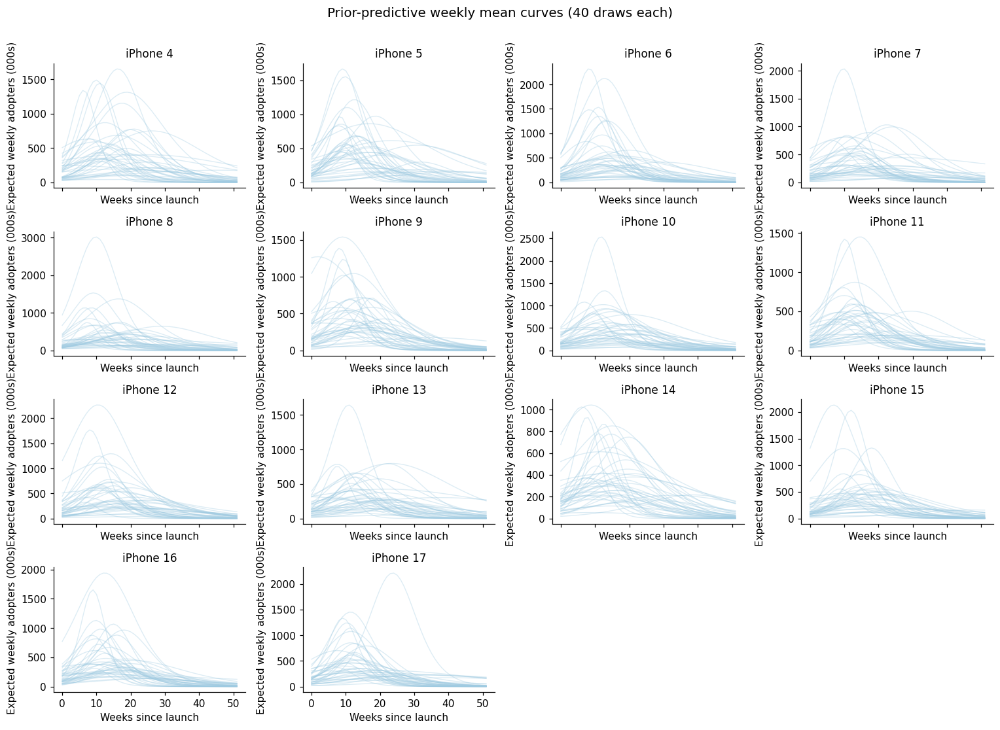{width=100%}

Here is the core PyMC model:

```python
coords = {
    "product": products,
    "week": week_since_launch,
}

def pt_bass_cdf(t, p, q):
    expo = pt.exp(-(p + q) * t)
    return (1.0 - expo) / (1.0 + (q / p) * expo)

with pm.Model(coords=coords) as bass_model:
    m_millions = pm.LogNormal(
        "m_millions",
        mu=np.log(10.0),
        sigma=0.55,
        dims="product",
    )
    m = pm.Deterministic("m", 1_000_000.0 * m_millions, dims="product")
    p = pm.Beta("p", alpha=3.0, beta=197.0, dims="product")
    q = pm.Beta("q", alpha=3.0, beta=17.0, dims="product")
    alpha = pm.Exponential("alpha", lam=1.0 / 30.0)

    p_b = p[:, None]
    q_b = q[:, None]
    m_b = m[:, None]
    week_t = pt.arange(n_weeks)

    mu_raw = m_b * (
        pt_bass_cdf(week_t + 1, p_b, q_b)
        - pt_bass_cdf(week_t, p_b, q_b)
    )
    mu_week = pm.Deterministic(
        "mu_week",
        pt.maximum(mu_raw, 1e-6),
        dims=("product", "week"),
    )

    peak = pm.Deterministic(
        "peak",
        pt.maximum(0.0, pt.log(q / p) / (p + q)),
        dims="product",
    )

    pm.NegativeBinomial(
        "y",
        mu=mu_week,
        alpha=alpha,
        observed=y_obs,
        dims=("product", "week"),
    )
```

After sampling with NUTS, the diagnostics looked clean in this synthetic run:

| Diagnostic | Result |
| --- | ---: |
| Divergences | 0 |
| Max R-hat | 1.000 |
| Minimum bulk ESS | 3,607 |
| Minimum tail ESS | 2,622 |

Clean diagnostics do not prove Bass diffusion is the true data-generating
process. They tell us the sampler explored the posterior for the model we
asked it to fit.

## What the posterior gives us

Once the model has a posterior over $m$, $p$, and $q$, every downstream
quantity becomes a posterior distribution too:

- market potential;
- cumulative adoption curves;
- expected weekly adoption;
- posterior predictive counts;
- peak timing;
- the implied split between innovation and imitation.

The weekly fit below separates two layers of uncertainty. The narrower band is
uncertainty about the expected Bass mean $\mu_w$. The wider predictive band
adds Negative Binomial observation noise.

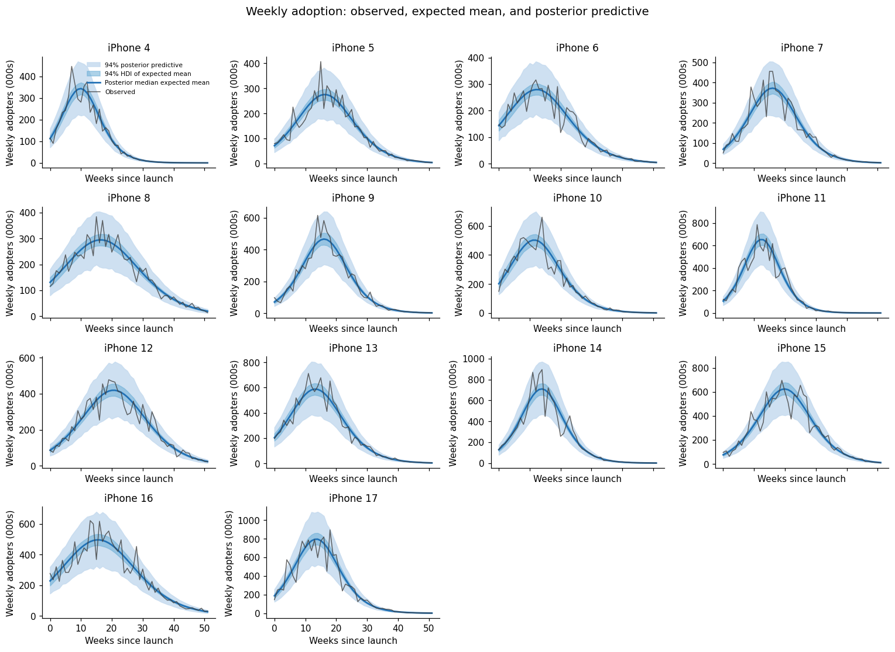{width=100%}

Market potential is especially useful, but also easy to overinterpret. It is
the model's inferred eventual adopter pool if the same diffusion process runs
toward saturation. It is not the last observed cumulative count.

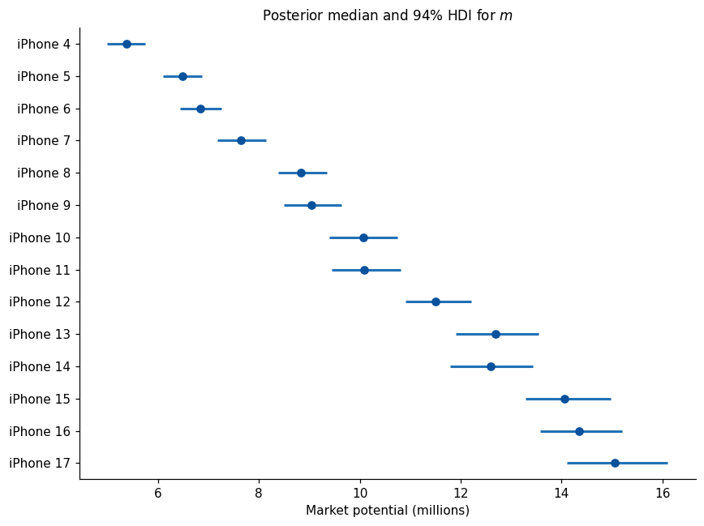{width=100%}

Peak timing is different. It is not a free parameter. It is a deterministic
function of $p$ and $q$, so uncertainty in innovation and imitation naturally
becomes uncertainty in the peak week.

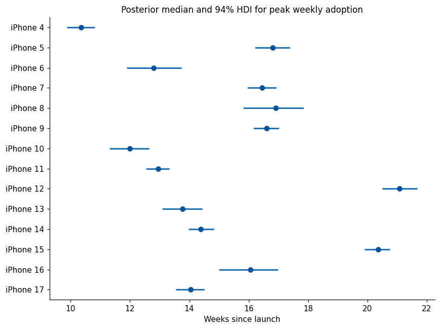{width=100%}

This is one of the main reasons I like fitting the model in a Bayesian way. We
do not get one estimated S-curve and then bolt uncertainty on at the end. We
get uncertainty over the parameters, then push it through the adoption math.

## Innovators and imitators

The Bass rate can be split into two additive terms:

$$
f(t) =
p(1 - F(t)) + qF(t)(1 - F(t)).
$$

Multiplying by $m$ gives an innovator component and an imitator component:

$$
r_{\text{innovator}}(t) = mp(1 - F(t)),
$$

$$
r_{\text{imitator}}(t) = mqF(t)(1 - F(t)).
$$

For weekly data, those components need to be integrated over each week. The
innovator piece has a closed form:

$$
I_w =
m \frac{p}{q}
\log\left(
\frac{p + qe^{-(p+q)w}}
{p + qe^{-(p+q)(w+1)}}
\right),
$$

and the imitator piece is the remaining expected weekly adoption:

$$
Q_w = \mu_w - I_w.
$$

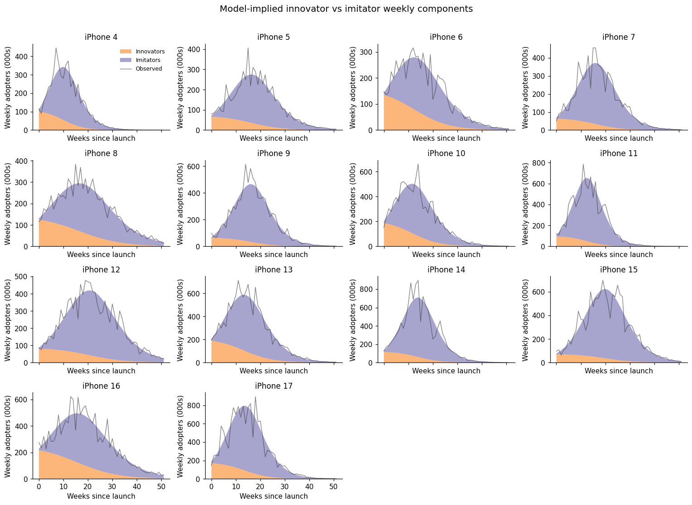{width=100%}

This decomposition is useful, but it is not causal attribution. A high
imitator share means the fitted Bass curve attributes adoption to the
$qF(1-F)$ term. It does not prove that particular consumers adopted because of
word of mouth.

## Forecasting a product before launch

The first model estimates Bass parameters from observed weekly adoption. That
works for historical products, but a pre-launch product has no adoption series
yet.

For a future product, the Bass likelihood cannot infer:

$$
m_{18}, \quad p_{18}, \quad q_{18}.
$$

But before launch we may know product-level information:

| Feature | Example interpretation |
| --- | --- |
| Price | Launch price may affect market potential and adoption speed |
| Inflation | Macro conditions may affect demand for a high-ticket item |
| Marketing budget | Awareness may affect market size, early adoption, or diffusion speed |
| Release gap | Time since the previous release may create replacement demand |

That suggests a second model at the product level.

Stage 1:

$$
\text{weekly adoption} \rightarrow p(m_i, p_i, q_i \mid D).
$$

Stage 2:

$$
\text{Bass posterior summaries} + X_i \rightarrow
\text{product-level regression}.
$$

The important detail is that Stage 2 should not treat the Stage 1 estimates as
perfectly observed. Bass parameters are transformed onto unconstrained scales:

$$
z_{m,i} = \log(m_i),
\qquad
z_{p,i} = \operatorname{logit}(p_i),
\qquad
z_{q,i} = \operatorname{logit}(q_i).
$$

Then Stage 1 posterior uncertainty becomes measurement uncertainty in Stage 2:

$$
\hat z_{m,i} \sim N(z_{m,i}, s_{m,i}),
$$

$$
z_{m,i} \sim N(\alpha_m + X_i\beta_m, \sigma_m).
$$

The same structure is used for $p$ and $q$.

This is not a fully joint model. A fully joint model would put the product
features and weekly adoption likelihood inside one probabilistic graph. The
two-stage version is more modular and easier to teach, but it has a limitation:
Stage 2 does not feed information back into Stage 1.

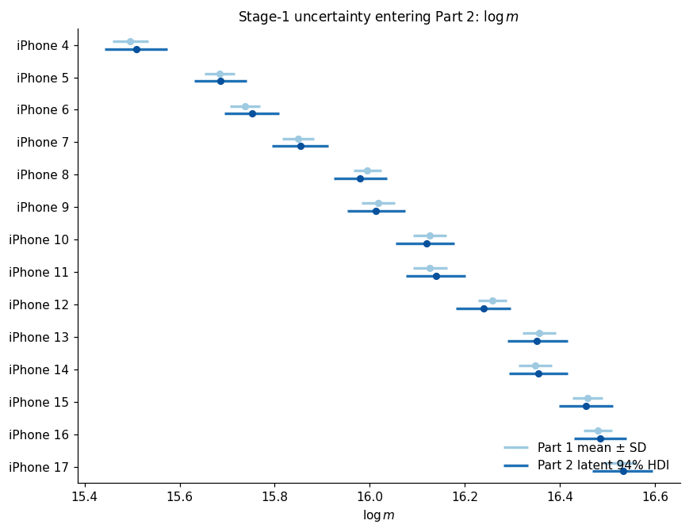{width=100%}

Before trusting the second stage for a future product, I want to see whether it
can reconstruct the historical Bass parameters from product-level launch
features.

Here, "actual" means the Stage 1 Bass posterior for each historical product.
Those values are not ground truth sales facts; they are the first-stage
estimates learned from the weekly adoption curves. "Predicted" means the
Stage 2 product-level regression expectation using launch features alone.
The green points add the product-specific residual for historical products,
which shows how much the Stage 2 model has to adjust after the feature
relationship has done its work.

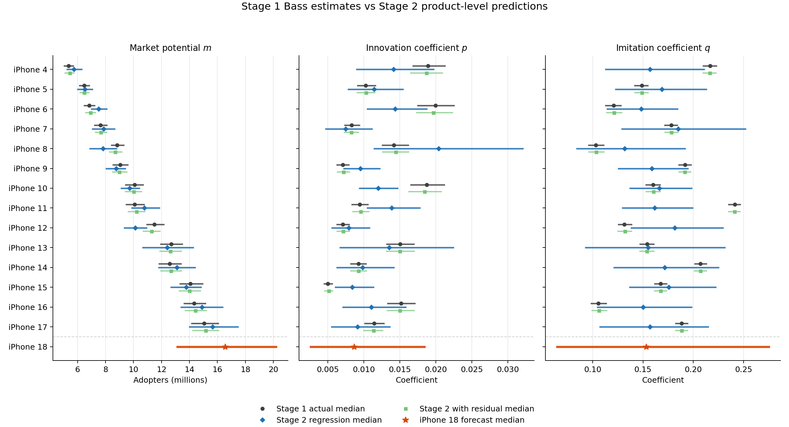{width=100%}

This plot is the most useful diagnostic in the new-product workflow. Market
potential is relatively well behaved: the feature-only Stage 2 predictions
track the increasing size of the historical products, and the iPhone 18
forecast lands in the next plausible range.

$p$ and $q$ are harder. The feature-only intervals are much wider, especially
for products where the first-stage curve can be fit by several combinations of
early innovation and later imitation. That is exactly the uncertainty a
pre-launch forecast should expose. The model is not saying "week 17 will be
the peak" with false confidence; it is saying "these product features imply a
family of plausible launch speeds."

The Stage 2 sample used for these figures had 3 divergences after tuning, with
maximum R-hat around 1.002. For a production model I would reparameterize or
raise `target_accept` before using it operationally. For this post, I keep it
because the purpose is to show the forecasting structure and the uncertainty
flow.

For the hypothetical future product, the synthetic assumptions are:

| Launch characteristic | Value |
| --- | ---: |
| Price | \$1,149 |
| Inflation | 2.3% |
| Marketing | \$3.40 bn |
| Release gap | 52 weeks |

Pushing those assumptions through the Stage 2 model gives a pre-launch
posterior over Bass parameters. There are two related quantities worth keeping
separate:

| Parameter | Feature-only regression median | Full new-product forecast median |
| --- | ---: | ---: |
| $m$ | 16.59m [14.54m, 19.00m] | 16.56m [13.07m, 20.28m] |
| $p$ | 0.0088 [0.0047, 0.0139] | 0.0086 [0.0025, 0.0185] |
| $q$ | 0.1541 [0.0941, 0.2174] | 0.1531 [0.0637, 0.2760] |

The feature-only column is the regression mean implied by price, inflation,
marketing, and release gap. The full forecast column adds the new-product
residual variance. That residual is why the launch forecast is wider than the
line fitted through the product features. A future product is not just "the
average product with these covariates"; it may sit above or below the
historical feature relationship.

Those parameter draws are then passed back through the Bass equations to create
forecast adoption curves.

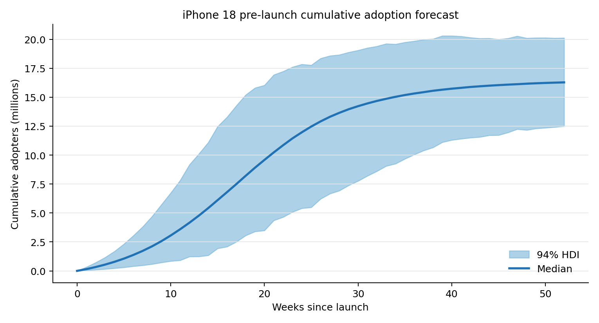{width=100%}

The cumulative S-curve is the easiest business-facing view. In this synthetic
run, first-year cumulative adoption has a median of about 16.3 million, with a
94 percent interval from 12.5 million to 20.1 million.

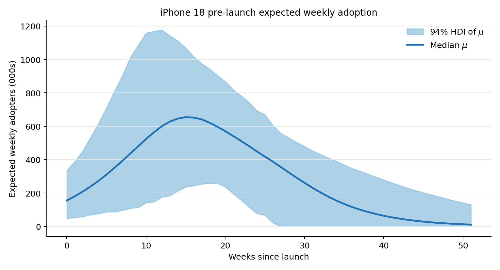{width=100%}

The weekly view makes timing visible. The median continuous-time peak is around
week 17.2, while the median weekly curve reaches its highest discrete weekly
mean around week 15. At that peak, expected weekly adoption is roughly 655,000
adopters, with a 94 percent interval from about 235,000 to 1.07 million.

There are two useful forecast layers:

1. uncertainty in the expected Bass mean $\mu_w$;
2. uncertainty in an observed weekly count, after adding Negative Binomial
   observation noise.

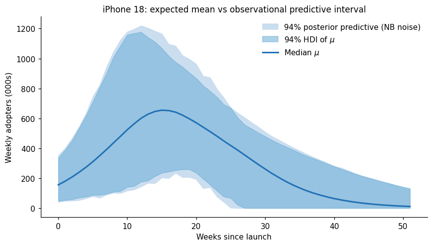{width=100%}

The predictive interval is wide because several uncertainties stack together:
the small 14-product cross-section, the new product residual, uncertainty in
the Bass parameters, and observation noise.

Finally, the same iPhone 18 parameter draws can be decomposed into the
innovation and imitation components of the forecast. This uses no extra model:
it is just the Bass equation split into the $p(1-F)$ and $qF(1-F)$ pieces for
each posterior draw.

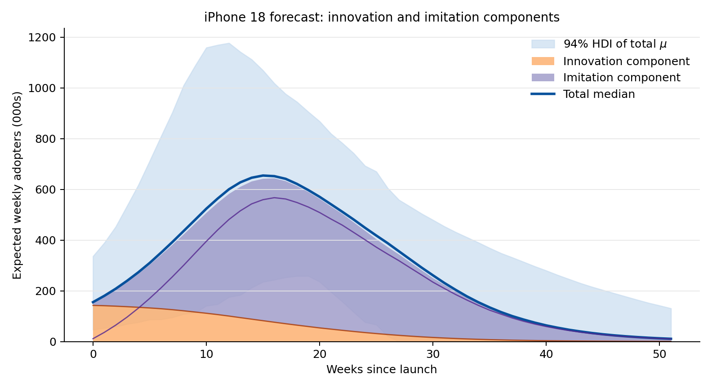{width=100%}

In the first-year forecast, the median innovation component contributes about
2.74 million adopters, while the median imitation component contributes about
13.44 million. In share terms, that is roughly 16.8 percent innovation and
83.2 percent imitation. Again, this is model accounting, not causal proof. It
says how the fitted Bass curve allocates the forecasted adoption path between
independent adoption pressure and installed-base-driven adoption pressure.

## A local marketing sensitivity

The same two-stage setup can answer a local sensitivity question:

> According to the fitted model, how would `iPhone 17` adoption change if its
> marketing budget had been 1 percent higher?

The baseline synthetic marketing budget is \$3.100bn. The counterfactual budget
is:

$$
M_{17}^{CF} = 1.01M_{17} = \$3.131\text{bn}.
$$

Price, inflation, and release gap stay fixed. Because marketing enters on the
log scale, the perturbation is:

$$
\Delta \log M = \log(1.01).
$$

For a same-product counterfactual, we keep the product residual fixed and shift
only the marketing predictor on each posterior draw:

$$
z_{m,17}^{CF} =
z_{m,17}^{\text{base}} + \beta_{M,m}\Delta X_M,
$$

with the same operation for $p$ and $q$. Then both the baseline and
counterfactual parameters are passed through the full Bass curve.

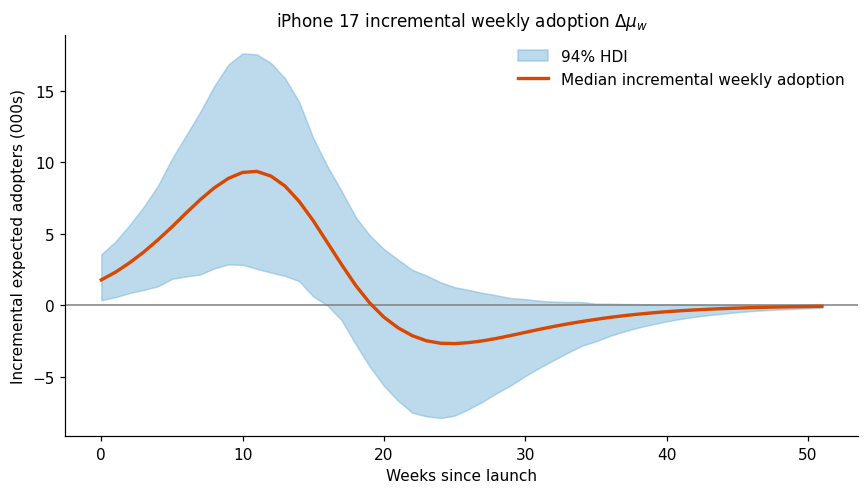{width=100%}

In this synthetic run, the median result was about 70,000 additional expected
adopters over 52 weeks, with a 94 percent interval from roughly 300 to 156,000.
That is a median uplift of about 0.46 percent.

This result should be read carefully. The marketing coefficients were given
HalfNormal priors, which impose a non-negative marketing relationship. The
model is estimating the magnitude of a positive association under that
assumption. It is not testing whether marketing can have a negative effect, and
it is not proving causal incrementality.

## Why I would not estimate marketing saturation here

It is reasonable to expect diminishing returns to marketing. But this
product-level model has only 14 historical launches. That is not enough
information to learn a reliable nonlinear marketing response curve at the same
time as the relationships between product features and Bass parameters.

A Hill curve, for example, would require:

$$
g(M) = \frac{M^s}{M^s + K^s}.
$$

With only 14 product rows, estimating $K$, $s$, and the marketing coefficient
magnitude is asking too much from the cross-section.

If a separate MMM has already estimated a credible media response curve, I
would use that external information. In practice:

1. take representative saturation parameters from the MMM posterior;
2. transform each product's budget through that response curve;
3. use the transformed marketing variable in the product-level Bass submodel;
4. run robustness checks at several plausible saturation settings.

The small Bass submodel should not relearn the saturation curve from scratch.

## What this gives us

Bass diffusion is useful because it turns an adoption story into a small set of
interpretable parameters:

- $m$ describes eventual market potential;
- $p$ describes independent early adoption;
- $q$ describes imitation-driven acceleration;
- peak timing is derived from $p$ and $q$;
- weekly and cumulative forecasts come from the same curve.

The Bayesian version is useful because it carries uncertainty into every
derived quantity. Instead of reporting one launch curve, we can report a family
of plausible curves. Instead of pretending that pre-launch forecasts are
precise, we can show where the model is unsure.

The two-stage extension is a practical bridge from historical launch curves to
pre-launch planning. It is not a causal model of product demand, and the
synthetic example is intentionally simple. But it shows a workflow that is
often useful in real planning conversations:

$$
\text{historical adoption curves}
\rightarrow
\text{Bass parameters}
\rightarrow
\text{product-level drivers}
\rightarrow
\text{future adoption forecast}.
$$

That is the core idea: product adoption forecasting should forecast the curve,
not just the total.
